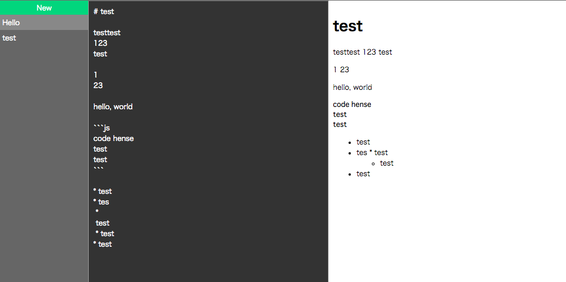

# Loopback, Vue, MySQL example

Just a simple markdown editor using MySQL for study.

The project is generated by [LoopBack](http://loopback.io).

# Setup

 * `npm install`
 * Edit server/datasources.json
 * `node bin/migrate.js`

# Development

 * `npm run dev`

# Execute

 * `slc run`
